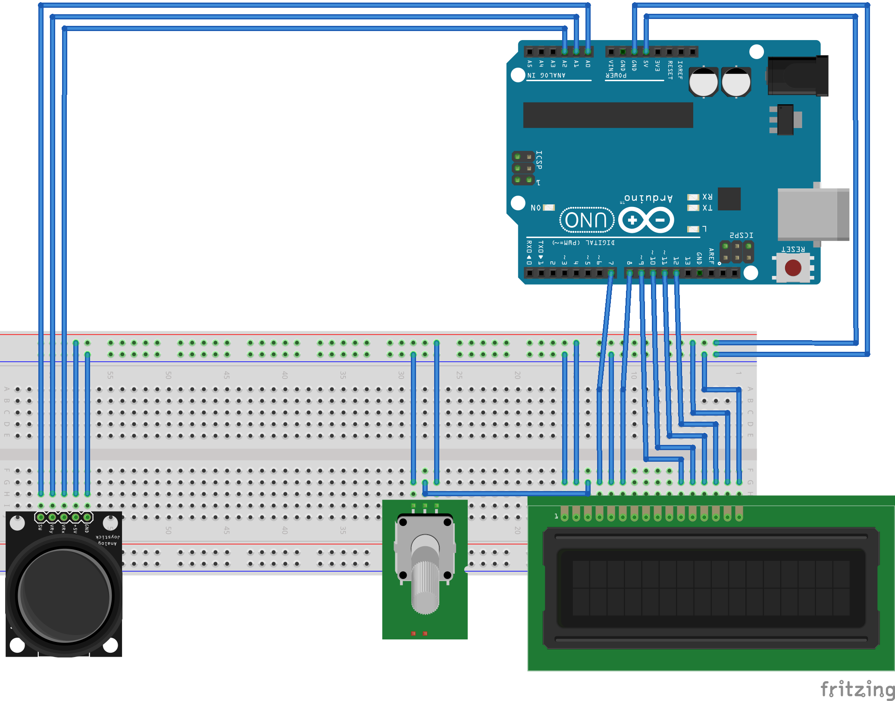

# Arduino Minigame "Dodgy"
A mini game console is created with an Arduino, LCD screen and joystick.
You can play a simple game "Dodgy" on it, in which you have to dodge blocks.

## Details
The LCD screen is used to display a movable blob and several blocks chasing it. Before a level starts, a countdown is shown.
Input of joystick (X, Y, SW) is read by Arduino analog pins. A blob is moved accordingly on the screen.
According to the current level, blocks are created automatically and move from the right to the left with different speeds.
If the joystick button is pressed, the game is paused an can be resumed with another push of the button.

## Components
* Arduino Uno (I used Elegoo Uno R3)
* 10k potentiometer (I used kwmobile B10K)
* 16x2 LCD screen (I used Qapass 1602A)
* 2-axes joystick (I used KY-023 / HW-504)

## Circuit schema

